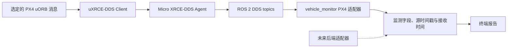

# 系统架构与接口

AeroBase 通过 uXRCE-DDS 将 PX4 遥测接入 ROS 2，并提供只读监测。PX4 消息的处理集中在适配层，使遥测新鲜度和展示逻辑不依赖某一种飞控消息类型。

## 模块职责

| 组件 | 职责 | 边界 |
| --- | --- | --- |
| PX4 Flight Stack | 驱动、状态估计、控制器、模式管理及飞行关键模块 | 执行飞行控制闭环；它不是 ROS 2 软件包或模拟器 |
| uORB | PX4 内部按类型发布和订阅消息的总线 | 只有经过配置的 Topic 会通过网络桥接 |
| uXRCE-DDS Client | PX4 端导出已配置的 uORB 消息 | 负责传输选定数据，不实现 AeroBase 策略 |
| Micro XRCE-DDS Agent | Companion 端的独立代理进程，将 Client 实体接入 DDS | 负责桥接消息，不是 ROS 2 应用节点，不承担飞控职责 |
| ROS 2 适配器 | 将 `px4_msgs` 消息和字段转换为监测输入 | 集中处理 PX4 专用名称、类型和字段语义 |
| 遥测状态 | 按数据流记录值、接收时间和新鲜度 | 不导入 ROS 2 或 PX4 消息类 |
| `vehicle_monitor` | 订阅并报告只读遥测 | 不发布 PX4 命令或调用 PX4 命令服务 |

PX4 模块和 uORB 说明见 [PX4 架构指南](https://docs.px4.io/main/en/concept/architecture)，消息桥见 [uXRCE-DDS 文档](https://docs.px4.io/main/en/middleware/uxrce_dds)。ROS 2 应用层见官方 [Node](https://github.com/ros2/ros2_documentation/blob/jazzy/source/Concepts/Basic/About-Nodes.rst) 和 [Topic](https://github.com/ros2/ros2_documentation/blob/jazzy/source/Concepts/Basic/About-Topics.rst) 文档。

## 并行的 DDS 与 MAVLink 链路

```text
ROS 2 集成：
PX4 module → uORB → PX4 uXRCE-DDS Client
  → XRCE over UDP 或串口 → Micro XRCE-DDS Agent → DDS → ROS 2 Topic → Node

MAVLink 集成：
PX4 module → uORB → MAVLink module
  → MAVLink over UDP 或串口 → Ground Station / MAVSDK / pymavlink / Companion app
```

PX4 可以并行提供两条链路。DDS 将配置好的 PX4 消息类型送到 ROS 2 节点；MAVLink 服务于地面站和 MAVLink 应用。两者使用不同的消息定义、传输配置并占用相应带宽。PX4 遥测进入 ROS 2 不需要先经过 MAVLink。MAVROS 是可选的 MAVLink 到 ROS 适配方案，不属于当前基线。

逻辑上并行不代表物理串口可被多个消费者直接共用；需要规划端口路由、网络配置和带宽。2026-10-09 集成报告所列 WSL2 验证配置中的进程运行于同一 WSL2 实例，XRCE 使用 UDP 8888，DDS domain 为 0。

当前只读组合在 XRCE Agent 端使用 Fast DDS，在 ROS 2 端使用 Cyclone DDS。记录的 SITL 遥测链路验证了此组合。未来如加入控制或服务接口，需单独定义消息、QoS、兼容性和失联行为并进行验收。

## Flight Controller 与 Companion 边界

Flight Controller 负责传感器采集、状态估计、姿态与控制闭环、执行器分配、解锁检查、模式管理和飞行关键故障处理。ROS 2 或 Companion 适合承载遥测展示与记录、视觉处理、建图、规划和任务协调。这是 AeroBase 采用的职责划分，不构成对具体飞行器的安全认证。

SITL 中 PX4 与 Companion 应用可以运行在同一主机上，软件职责仍然分开。实体硬件的调度、驱动、传感器和通信时延需要在目标设备上另行取证。外部规划或 AI 软件不能替代飞控自身的检查与控制闭环。

## 遥测数据流



适配器将 PX4 消息转换为带单位、坐标标签和状态名称的监测字段；独立的遥测状态逻辑记录源时间戳与接收时间，应用新鲜度规则并准备报告。当前字段以终端监测为用途，并非通用飞控 SDK 的数值接口。其他后端接入时，应依据实际需求完善公共数据契约并提炼共用行为。当前仓库仅实现 PX4 DDS 适配器。

## 消息与 Topic 契约

| 遥测 | 基线 ROS 2 Topic | 是否为 connected 必选 |
| --- | --- | --- |
| `VehicleStatus` | `/fmu/out/vehicle_status_v1` | 是 |
| `VehicleOdometry` | `/fmu/out/vehicle_odometry` | 是 |
| `BatteryStatus` | `/fmu/out/battery_status_v1` | 否 |
| `VehicleGlobalPosition` | `/fmu/out/vehicle_global_position` | 否 |

Topic 可加车辆命名空间，例如 `/uav_1/fmu/out/vehicle_status_v1`。版本后缀遵循消息的 `MESSAGE_VERSION`：非零时追加 `_vN`。Topic 名称相同不代表消息兼容；使用不同 `px4_msgs` 修订版本构建前，应比较固定消息字段定义。源码修订见 [stack.lock.json](../config/stack.lock.json)。

订阅使用 ROS 2 sensor-data QoS：best effort、volatile durability、keep last，优先接收及时遥测而非回放历史样本。兼容规则见 [ROS 2 QoS 文档](https://github.com/ros2/ros2_documentation/blob/jazzy/source/Concepts/Intermediate/About-Quality-of-Service-Settings.rst)。节点使用 ROS 自带的日志和参数接口，不创建 PX4 命令发布器或命令服务客户端。

## 时间、坐标系与健康状态

- PX4 消息时间戳来自飞控，可能与监测进程使用不同的时钟。新鲜度按本机单调接收时间判断，默认超时为 3 秒。
- `connected` 表示两条必选流都在超时窗口内持续到达。一条必选流过期为 `degraded`；两条都过期为 `disconnected`；尚未收到必选数据为 `waiting`。这些状态描述数据传输，不代表估计器有效或具备飞行条件。
- 重复源时间戳不会刷新数据流；PX4 时间戳重置后可重新接收。多机扩展需定义实例身份、domain、命名空间和重启行为。
- PX4 常用 NED / FRD 坐标系，ROS 应用常用 ENU / FLU。监测器保留输入坐标并显示 frame 标识，不进行隐式转换。
- 无效浮点数、电池估值或全局坐标显示为 `unknown`；过期字段标记为 `stale`，不会用零值替代。
- 全局高度为 AMSL 米，不是相对起飞点高度。SITL 坐标不等于实体 GNSS 测量值。

固定消息字段语义见 [`VehicleOdometry`](https://github.com/PX4/px4_msgs/blob/86d8239e962f6939e05c3737784f60c02fa884db/msg/VehicleOdometry.msg)、[`VehicleGlobalPosition`](https://github.com/PX4/px4_msgs/blob/86d8239e962f6939e05c3737784f60c02fa884db/msg/VehicleGlobalPosition.msg) 和 [`BatteryStatus`](https://github.com/PX4/px4_msgs/blob/86d8239e962f6939e05c3737784f60c02fa884db/msg/BatteryStatus.msg)。
